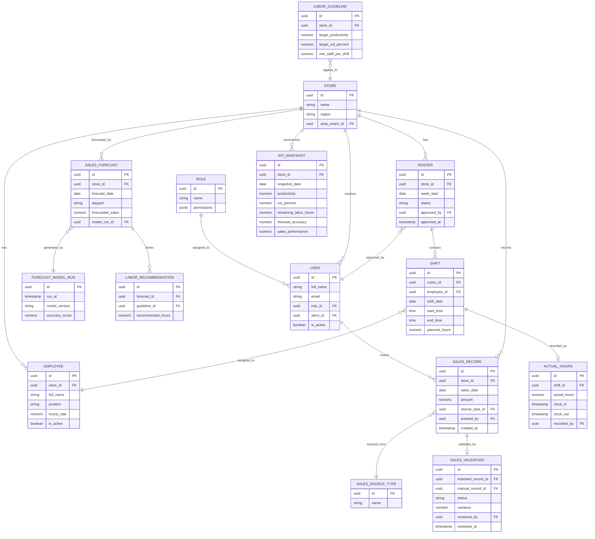

# Database Design

PostgreSQL schema managed via Prisma (`backend/prisma/schema.prisma`), matching
the ER diagram supplied in `master_roster_erd.html` exactly. UUID primary keys
throughout (`gen_random_uuid()`, via the `pgcrypto` extension).

## Entity-Relationship Diagram

A standalone rendered version of this diagram is available in the originally
uploaded `master_roster_erd.html`; a plain SQL DDL version (with comments
and seed data) is also available as `master_roster_schema.sql`.

## Table Notes

- **role**: `permissions` is a JSON array of permission codes (e.g. `["sales:view", "schedule:generate"]`), read by the `authorize` middleware. `"*"` (used by the current system identity) means unrestricted.
- **store**: `area_coach_id` points at a `user` — the circular `store ↔ user` reference is resolved in Prisma by making both foreign keys nullable/optional; in raw SQL it requires adding the `store.area_coach_id` FK via `ALTER TABLE` after both tables exist (see `master_roster_schema.sql`). **No unique "code" column** — Excel imports match stores by exact `name`.
- **user**: no password/credential column — see README §6 on the deferred login system. `store_id` is the user's home store (used by Store Managers); Area Coach → store assignment isn't yet modeled as a join table in this ERD (only `store.area_coach_id`, a single coach per store).
- **employee**: no `employment_type` (full-time/part-time) field, so the roster generator can't prioritize by employment type — see README §5.
- **sales_source_type**: lookup table (`POS_IMPORT`, `MANUAL_ENTRY`, `EXCEL_IMPORT`).
- **sales_record**: one row per store/date/source; `entered_by` is nullable (imports don't have a human enterer).
- **sales_validation**: compares an imported record against a manually entered one for variance review; `imported_record_id` is unique (one validation row per imported record).
- **sales_forecast**: unique on `(store_id, forecast_date, daypart, model_run_id)`; `daypart` defaults to `FULL_DAY` since the current forecasting service doesn't split by daypart yet.
- **forecast_model_run**: one row per forecast batch, storing which method/version produced it — used for future accuracy tracking.
- **labor_guideline**: per-store target productivity (sales THB per labor hour), target Cost-of-Labor %, and minimum staff per shift. The roster generator currently only uses `target_productivity`; `target_col_percent` and `min_staff_per_shift` are modeled but not yet enforced by the algorithm.
- **labor_recommendation**: links a forecast to a guideline with a computed recommended-hours figure — modeled in the schema but not yet populated by a service (a natural next step: have `rosterService` write one of these alongside each roster it generates).
- **roster / shift**: header/detail pattern, one roster per store/week, shifts underneath. Shift windows are currently fixed constants in code (no `shift_template` table in this ERD) — see README §5.
- **actual_hours**: 1:1 with `shift` (`shift_id` is unique) — actual hours are recorded per shift, not aggregated per store/day.
- **kpi_snapshot**: designed for a future scheduled job to persist daily rollups (productivity, COL%, remaining hours, forecast accuracy, sales performance). The current dashboard computes these live instead of reading this table — see `dashboardService.js`.

## What's intentionally not modeled here (vs. an earlier design)

- No `activity_log` table — audit logging is console-only for now (see README §7).
- No `shift_template` or `employee_availability` tables — the roster generator uses fixed shift windows and no availability filtering.
- No user credentials table — login is deferred.

Add these back to `schema.prisma` (and re-run `prisma migrate dev`) if you want that functionality restored.

## Indexing & Integrity

- Composite indexes on `(store_id, sales_date)`, `(store_id, forecast_date)`, `(store_id, snapshot_date)`, `(roster_id)`, and `(employee_id, shift_date)` support the dashboard and roster queries.
- Unique constraints prevent duplicate forecast rows per store/date/daypart/run, duplicate rosters per store/week, and more than one `actual_hours` row per shift.
