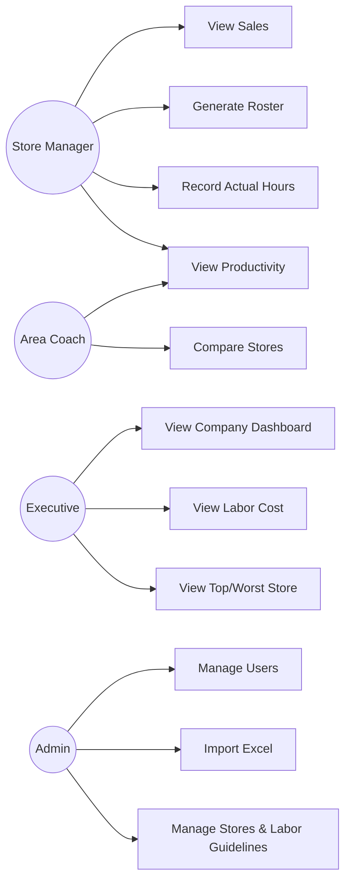
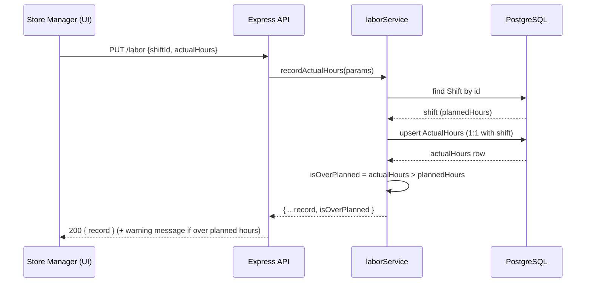
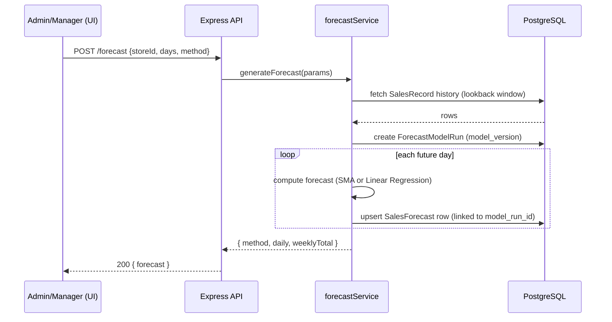

# Use Case & Sequence Diagrams

## Use Case Diagram



> Note: these roles/permissions are already modeled in `Role.permissions` and
> checked by the `authorize`/`storeScope` middleware, but every request
> currently authenticates as a fixed Admin-equivalent identity (login is
> deferred — see README §6), so in practice every use case above is reachable
> by anyone right now.

## Sequence Diagram — Auto Roster Generation

```mermaid
sequenceDiagram
    participant M as Store Manager (UI)
    participant API as Express API
    participant S as rosterGenerationService
    participant DB as Supabase (PostgreSQL)

    M->>API: POST /roster/auto-generate {storeId, startDate, endDate, regenerate}
    API->>API: authenticate (fixed identity) + authorize(schedule:generate) + storeScope
    API->>S: generateDraftRoster(params)
    S->>DB: fetch store's LaborGuideline, active employees, hourly forecast, monthly capacity
    DB-->>S: rows
    S->>S: size staffing per hour from the forecast, productivity floor, and daily/monthly budgets
    loop each day
        S->>S: guarantee opening (09:00) + closing (22:00) coverage, then fill to the operational minimum
        S->>S: Full-time = 8 working hours + 1h break (9h clock span); Part-time = 4-8h
        S->>S: enforce weekly hours, 6-consecutive-day rest, no double booking, monthly capacity
    end
    S->>DB: replace Shift rows for the range (create/reuse one Roster row per ISO week)
    DB-->>S: roster with shifts
    S-->>API: result (rosterIds, shifts, validation)
    API-->>M: 201 { result } — status always DRAFT, never auto-approved
```

## Sequence Diagram — Recording Actual Hours



## Sequence Diagram — Sales Forecast


